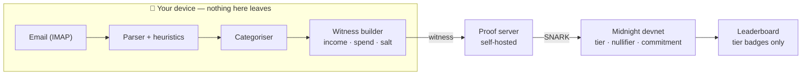

# Cache

**A savings game for students where nobody ever sees your money.**

> **For** students who want to compete with friends on saving money, **who** would
> otherwise have to either lie about their numbers or hand their bank data to a
> stranger, **we** prove they hit their savings goal **without revealing** income,
> spending, or a single transaction.

A competitive savings leaderboard is impossible to build honestly. Self-reported
numbers mean everyone lies. Server-verified numbers mean everyone uploads their bank
account to a startup's database. Cache is the third option: your phone generates a
zero-knowledge proof that you hit your goal, and the only thing that becomes public
is a tier number.

Built for the MLH Midnight Hackathon, August 2026.

---

## Demo

**Video:** _<!-- TODO: link -->_
**Screenshot:** _<!-- TODO: City + Prove -->_

The loop: connect your email → transactions are parsed and categorised on-device →
seal the month → **a real SNARK is generated in ~3 seconds** → your tier is published,
tokens are minted, and your city grows. Friends see the tier. Nobody sees the money.

---

## Quick start

Requires Docker and Node 20+.

```bash
git clone https://github.com/tisya05/cache && cd cache
npm install

# 1. Start a local Midnight devnet (node + indexer + proof server)
docker compose -f docker/devnet.yml up -d

# 2. Compile the contract and generate ZK keys
npm run compile --workspace=contract

# 3. Prove it works — real SNARKs, real rejections
npm run test --workspace=contract
npm run test --workspace=ingest

# 4. Run the app
npm run dev --workspace=ui
```

---

## Architecture



Four circuits: `register`, `updateTotals`, `proveSavings`, `build`.
Five ledger fields, none of them private: `commitments`, `nullifiers`, `tiers`,
`blocks`, `savingsBalance`.

---

## Why Midnight

Remove the zero-knowledge layer and the product stops existing. A savings
leaderboard needs verified numbers; verified numbers normally mean surveillance.
This is the only construction where both hold.

Three canonical Midnight patterns, each used because the design needs it:

- **Commitments** (`persistentCommit`, four domain-separated prefixes) seal your
  totals before the leaderboard is visible, so results can't be revised after the fact.
- **Nullifiers** (`persistentHash([secret, periodId])`) block double-claims and
  multi-account farming.
- **A carry-forward committed balance** means claimed savings must still exist next
  period — sustained lying breaks the books.

**The savings-rate trick.** Savings rate is `(income − spend) / income`. Division is
expensive in a ZK circuit, so it's rearranged to use only multiplication:

```compact
assert((income - spend) * 100 >= (tier * 10) * income,
       "savings below claimed tier");
```

### What stays private

Income, every transaction, categories, merchants, and your identity secret never
leave the device. The chain stores a tier, a nullifier, and opaque commitments.

Every boundary where data does cross:

| Boundary | What crosses | Mitigation |
|---|---|---|
| Device → LLM | Memo text + bucketed amount, ambiguous transactions only | Known merchants categorised locally with zero disclosure; names stripped; amounts bucketed to $25 brackets; the user previews the exact payload and a structural gate rejects any batch that doesn't match it |
| Device → proof server | Witness (income total, spend total, salt) | Self-hosted on localhost |
| Device → chain | Tier, nullifier, commitment, block count | Public by design; commitments are opaque |
| IMAP → device | Email bodies | Local only — never reaches a server |

Note: the LLM is Gemini Flash on the free tier, where Google may use inputs to
improve their models. That is why heuristics handle the majority locally and only
stripped fragments are ever sent.

---

## Evidence

Compiled with Compact CLI 0.5.2, compiler **0.31.1**, language **0.23**, targeting
ledger 8.1.0. All four circuits produce prover and verifier keys.

`npm run test --workspace=contract` — **17 passed**:

```
PROOF RECEIVED          : 4508 bytes in 3.3 s
proof magic             : "midnight:proof-versioned:"

REJECTED with           : failed assert: savings below claimed tier
honest tier 1 on same totals: ACCEPTED (tier = 1, blocks = 2)

first claim             : ACCEPTED (tier = 4, blocks = 5)
replay (identical)      : REJECTED with: failed assert: period already claimed
replay (fresh totals)   : REJECTED with: failed assert: period already claimed

[tier out of range]     REJECTED with: failed assert: tier out of range
[commitment mismatch]   REJECTED with: failed assert: commitment does not match local totals
[double registration]   REJECTED with: failed assert: user already registered
[sentinel commitment]   REJECTED with: failed assert: totals do not match committed fingerprint
[no blocks]             REJECTED with: failed assert: no unspent blocks
```

`npm run test --workspace=ingest` — **95 passed**.

The rejection tests pair each failure with an honest claim on the *same* committed
totals, so the rejection is demonstrably about the tier rather than a broken fixture.

---

## Limitations

Stated plainly, because a privacy product that can't name its own boundaries hasn't
earned the claim.

**Within a single period, unsigned self-entered data can be inflated.** Automated
email ingest raises the effort bar; it is not a cryptographic guarantee. The chain
never sees your email — it sees a number the client submitted.

The closure is **DKIM**. Every email from a bank or payment app is cryptographically
signed by the sending domain, and [ZK Email](https://docs.zk.email/architecture/dkim-verification)
proves in zero knowledge that such an email exists containing a given amount.
Compact's standard library exposes hashing, commitments, Merkle paths and curve
operations, but **no RSA, no big-integer modular exponentiation, and no SHA-256**,
which DKIM requires. Documented as the production path rather than implemented.

Also not real yet: transactions in the demo are seeded (they run through the real
parser and categoriser, not pre-labelled fixtures), the leaderboard's friends are
seeded accounts, and there is no multi-user backend.

---

## Next

DKIM-verified ingest, on-device proving, and a portable savings credential for people
with no credit history.

---

## Built with

`compact` · `midnight` · zero-knowledge proofs · React 19 · TypeScript · Vite ·
Tailwind v4 · PWA · IMAP · Gemini Flash

Isometric city sprites and illustrations generated for this project.
