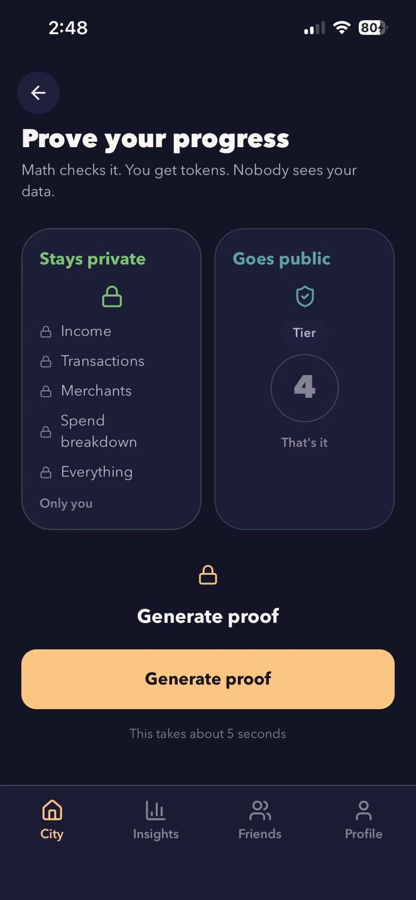
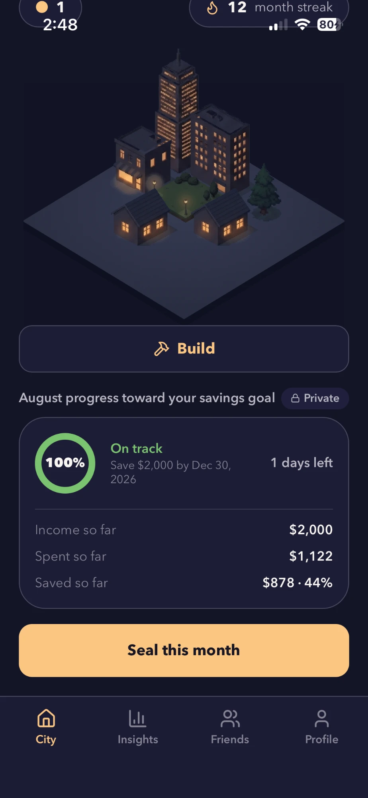
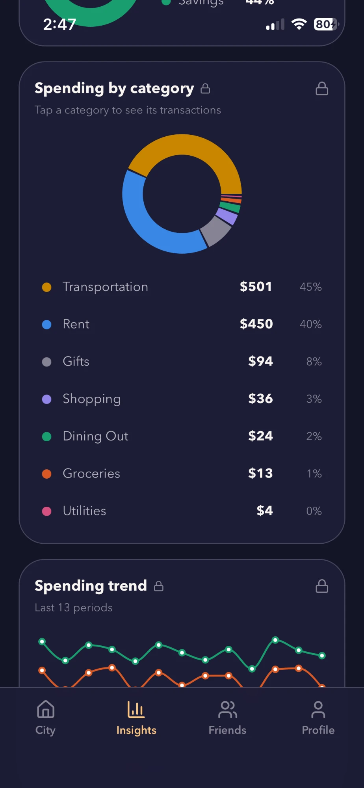
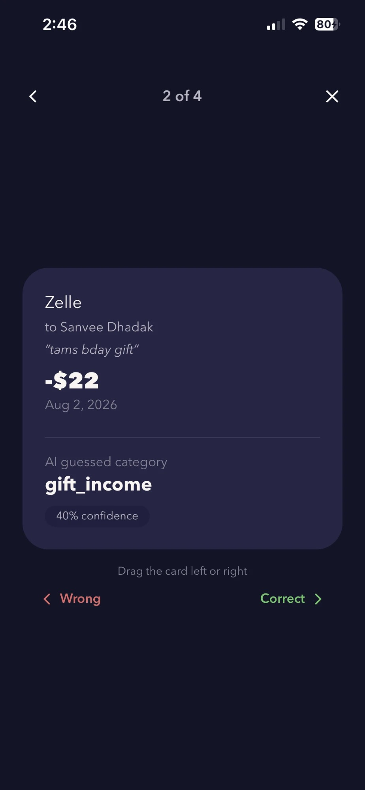
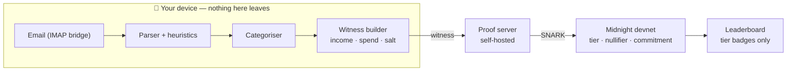

# Nomi

### Save together. Reveal nothing.

**A savings game for students where nobody ever sees your money.**

> **For** students who want to compete with friends on saving money, **who** would otherwise have to either lie about their numbers or hand their bank data to a stranger, **we** prove they hit their savings goal **without revealing** income, spending, or a single transaction.

Saving money with friends should not require sharing your bank balance.

Nomi lets you compete on savings while keeping your financial data private. Your device processes your transactions locally, generates a zero-knowledge proof that you hit your savings goal, and publishes only your savings tier.

You see the progress.

Your friends see the progress.

Nobody sees the money.

---

## ✨ The idea

A competitive savings leaderboard has a pretty annoying problem.

Self-reported numbers are easy to fake. Server-verified numbers mean handing your financial data to someone else.

**Nomi is the third option.**

```text
Your financial data
        │
        ▼
   Process locally
        │
        ▼
   Calculate savings
        │
        ▼
 Generate ZK proof
        │
        ▼
   Verify on Midnight
        │
        ▼
 Publish savings tier
```

The result is a savings game where you can prove that you hit a goal without revealing the information behind the proof.

---

## 🎮 Save → Prove → Build

Nomi turns saving money into a game.

|                |                                                                                |
| -------------- | ------------------------------------------------------------------------------ |
| **💰 Save**    | Set a savings goal and track your progress privately.                          |
| **🔐 Prove**   | Generate a zero-knowledge proof that your savings meet the required threshold. |
| **🪙 Earn**    | Verified milestones earn **Noms**, Nomi's in-game currency.                    |
| **🏙️ Build**  | Use your Noms to upgrade your city.                                            |
| **🏆 Compete** | Compare tiers and streaks with friends without exposing actual dollar amounts. |

---

## Demo

**Video:** *<!-- TODO: add demo link -->*

| Prove                                                                                                                                            | City                                                                                                                               |
| ------------------------------------------------------------------------------------------------------------------------------------------------ | ---------------------------------------------------------------------------------------------------------------------------------- |
|  |  |

| Insights                                                                                                            | Review queue                                                                                                      |
| ------------------------------------------------------------------------------------------------------------------- | ----------------------------------------------------------------------------------------------------------------- |
|  |  |

You can also check out the [friends leaderboard](docs/screenshots/friends.jpg), where only tiers and streaks are shown, and [a rejected tier claim](docs/screenshots/prove-rejected.jpg) where the contract itself rejects a replay:

```text
failed assert: period already claimed
```

---

# 🔒 Privacy by design

Nomi is built around a simple idea:

> **Your financial data belongs to you.**

Sensitive financial information is processed locally wherever possible.

### What stays private

* Income
* Spending
* Individual transactions
* Merchants
* Categories
* Identity secret

### What becomes public

* Savings tier
* Nullifier
* Opaque commitments
* Block count

The chain does not need your transaction history to verify your savings milestone.

It only needs to verify the proof.

---

# 🧠 How it works

### 1. Connect your email

Nomi reads transaction emails through a local IMAP bridge.

The email bodies are parsed on your own machine and do not get sent to a server.

### 2. Parse and categorize

Known senders and merchants are categorized locally using regexes and heuristics.

Examples include Amazon, Starbucks, Uber, DoorDash and bank alerts.

Ambiguous Venmo and Zelle transactions can be sent to Gemini Flash for classification.

Before anything is sent:

* Names are stripped
* Amounts are bucketed into $25 brackets
* Only ambiguous transactions are sent
* The exact payload is shown to the user
* A structural gate rejects anything that does not match the expected payload

Low-confidence transactions go into a manual review queue instead of being blindly trusted.

If Gemini is unavailable, ambiguous transactions simply fall back to manual review.

### 3. Calculate the savings claim

Once the transactions are categorized, Nomi calculates the relevant savings totals locally.

The result is a claim like:

```text
"I saved enough to reach Tier 4."
```

### 4. Generate a proof

Nomi generates a real zero-knowledge proof from the private values.

The underlying financial data is not revealed as part of the claim.

### 5. Verify on Midnight

Midnight verifies the proof and records the resulting tier.

### 6. Grow your city

A verified savings milestone earns Noms, which you can use to build and upgrade your city.

---

# 🌑 Why Midnight?

Without zero-knowledge, a social savings leaderboard has to choose between two bad options:

**Trust the numbers.**

Anyone can lie.

**Verify the numbers.**

Now someone has everyone's financial data.

Nomi uses Midnight so the claim can be verified without exposing the data behind it.

The privacy layer is not an extra feature on top of the game.

**It is what makes the game possible.**

---

# 🛠️ Technical architecture



Nomi currently uses four Compact circuits:

```text
register
updateTotals
proveSavings
build
```

And five ledger fields:

```text
commitments
nullifiers
tiers
blocks
savingsBalance
```

---

# 🔐 Zero-knowledge details

### Commitments

Nomi uses `persistentCommit` with four domain-separated prefixes to commit to totals before the leaderboard result is visible.

This prevents results from being revised after the fact.

### Nullifiers

Nomi derives nullifiers using:

```text
persistentHash([secret, periodId])
```

These prevent the same user from claiming the same period multiple times.

### Carry-forward balance

A committed carry-forward balance means claimed savings must still exist in the next period.

This makes sustained lying harder.

---

## The savings-rate trick

The savings rate is:

```text
(income - spend) / income
```

Division is expensive inside a ZK circuit, so Nomi rearranges the inequality to use multiplication instead:

```text
assert(
  (income - spend) * 100 >= (tier * 10) * income,
  "savings below claimed tier"
);
```

Same condition, without requiring division inside the circuit.

---

# 🤖 Transaction classification

Financial transaction data is messy.

Nomi uses a two-stage approach.

### Known transactions

Known senders are resolved locally using regexes and heuristics.

No external model sees these transactions.

### Ambiguous transactions

Genuinely ambiguous Venmo and Zelle memos can be batched through Gemini Flash.

Only stripped fragments are sent, with names removed and amounts bucketed.

Anything Gemini is not confident about can be manually reviewed.

Every correction is remembered, including corrections made later from the full transaction log.

---

# 🧪 What's real

Everything below is running in the current project.

### Real IMAP ingest

`ingest/scripts/serve.ts` runs the actual parser against a real Gmail inbox over IMAP and returns real transaction events.

It runs as a local bridge because IMAP requires a raw socket that a browser cannot open.

### Real categorization

Known senders resolve locally by regex.

Ambiguous Venmo and Zelle transactions can be classified through Gemini.

Low-confidence transactions go into the review queue.

### Real proofs

Every `proveSavings` call in the app runs the actual Compact circuit.

A tier claim that the totals do not support is rejected by the contract's own assertion.

### Real fallback behavior

No `GEMINI_API_KEY`?

Ambiguous transactions go to manual review.

Gemini gets rate-limited?

Same fallback.

The app does not crash because an external model is unavailable.

---

# 📊 Evidence

Compiled with:

* Compact CLI **0.5.2**
* Compiler **0.31.1**
* Language **0.23**
* Ledger **8.1.0**

All four circuits produce prover and verifier keys.

### Contract

`npm run test --workspace=contract`

**17 passed**

```text
PROOF RECEIVED          : 4508 bytes in 3.5 s
proof magic             : "midnight:proof-versioned:"

REJECTED with           : failed assert: savings below claimed tier
honest tier 1 on same totals: ACCEPTED (tier = 1, blocks = 2)

first claim             : ACCEPTED (tier = 4, blocks = 5)
replay (identical)      : REJECTED with: failed assert: period already claimed
replay (fresh totals)   : REJECTED with: failed assert: period already claimed

[tier out of range]     REJECTED with: failed assert: tier out of range
[commitment mismatch]   REJECTED with: failed assert: commitment does not match local totals
[double registration]   REJECTED with: failed assert: user already registered
[sentinel commitment]   REJECTED with: failed assert: totals do not match committed fingerprint
[no blocks]             REJECTED with: failed assert: no unspent blocks
```

### Ingest

`npm run test --workspace=ingest`

**95 passed**

The rejection tests pair each failure with an honest claim on the same committed totals, so the rejection is about the invalid claim rather than a broken fixture.

---

# 🚧 Limitations

A privacy product should be honest about its boundaries.

### Self-entered data

Within a single period, unsigned self-entered data can be inflated.

Automated email ingest raises the effort required to cheat, but it is not itself a cryptographic guarantee.

The chain never sees your email.

It sees a number submitted by the client.

### DKIM verification

The production closure is **DKIM**.

Bank and payment emails are cryptographically signed by their sending domains, and ZK Email can prove in zero knowledge that such an email exists containing a given amount.

Compact's standard library exposes hashing, commitments, Merkle paths and curve operations, but does not currently provide the RSA, big-integer modular exponentiation and SHA-256 primitives required for DKIM verification.

DKIM verification is therefore documented as the production path rather than implemented in this hackathon build.

### Current scope

The following pieces are currently simulated:

* Friends leaderboard accounts are seeded
* There is no multi-user backend
* The contract is running on a local Midnight devnet
* The contract has not been deployed to a live network

The client is written against a swappable interface, so deployment is designed to be a configuration change rather than a rewrite.

---

# 🚀 Quick start

Requires **Docker** and **Node 20+**.

```bash
git clone https://github.com/tisya05/cache && cd cache
npm install
cp .env.example .env
```

Fill in:

```text
GMAIL_USER
GMAIL_APP_PASSWORD
GEMINI_API_KEY
```

All are optional when using the seeded data.

### 1. Start the local Midnight devnet

```bash
docker compose -f docker/devnet.yml up -d
```

### 2. Compile the contract and generate ZK keys

```bash
npm run compile --workspace=contract
```

### 3. Run the tests

```bash
npm run test --workspace=contract
npm run test --workspace=ingest
```

### 4. Run the app

```bash
npm run dev --workspace=ui
```

### 5. Optional: real email ingestion

```bash
npx tsx --env-file=.env ingest/scripts/serve.ts
```

Without `.env` values, the app still runs end to end on seeded data through the same parser and categorizer used for a real inbox.

---

# 📚 Documentation

| Document                                     | What it covers                                      |
| -------------------------------------------- | --------------------------------------------------- |
| [`docs/DEVPOST.md`](docs/DEVPOST.md)         | Devpost submission copy, inspiration and challenges |
| [`docs/DEMO-SCRIPT.md`](docs/DEMO-SCRIPT.md) | Demo voiceover and shot list                        |

---

# 🌱 What's next

The long-term goal is simple:

**Make saving money social without making your finances public.**

The next steps are:

* DKIM-verified ingest
* On-device proving
* A portable savings credential
* More privacy-preserving savings challenges
* Friend groups, streaks and collaborative city building
* More proof types for financial milestones

For example:

```text
"I stayed under my dining-out budget."

"I saved for 6 consecutive months."

"I maintained an emergency fund."
```

The underlying financial history should not have to become public just to prove any of these things.

---

# 🧰 Built with

`Compact` · `Midnight` · `Zero-Knowledge Proofs` · `React 19` · `TypeScript` · `Vite` · `Tailwind v4` · `PWA` · `IMAP` · `Gemini Flash`

Isometric city sprites and illustrations generated for this project.

---

## Built for the MLH Midnight Hackathon

August 2026

**Nomi**

*Save together. Reveal nothing.*
